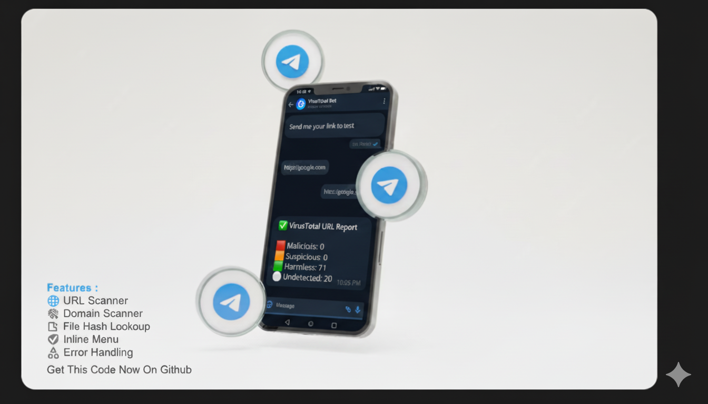
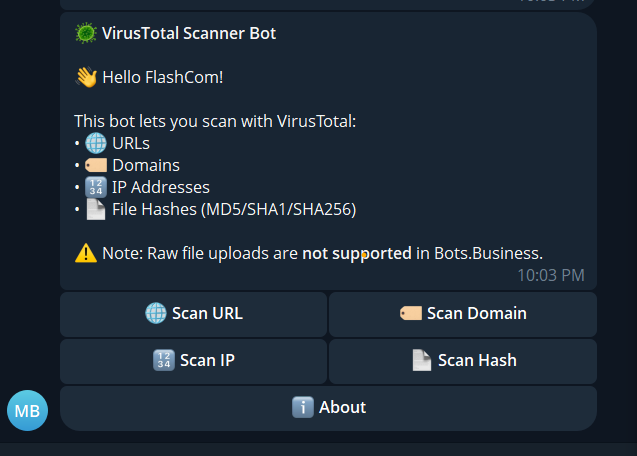
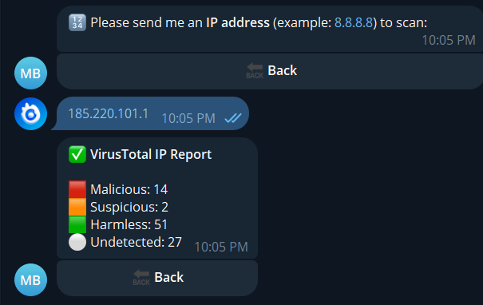
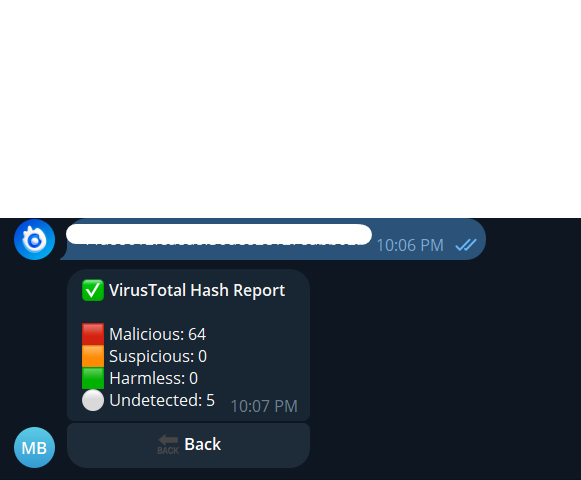
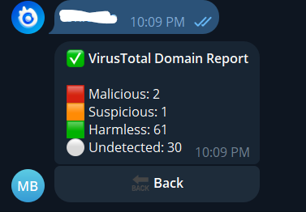

# 🦠 VirusTotal File Scanner Bot (Bots.Business) — v1.1 Full Release

A **Telegram bot** built on the [Bots.Business](https://bots.business/) platform that lets users check **URLs, Domains, IPs, and File Hashes** using **VirusTotal** and receive clear, readable reports right in chat.

This release upgrades the original URL-only beta to a **complete security scanner** with a **clean inline UI** (edits messages in place — no chat spam).

---

  

## 🚀 What’s New in v1.1

- 🌐 **URL** scan (supports direct file links too: `.zip`, `.rar`, `.7z`, `.txt`)  
- 🏷 **Domain** scan (check reputation of any domain)  
- 🔢 **IP address** scan (scan IPv4/IPv6 addresses)  
- 📄 **File hash** scan (MD5/SHA1/SHA256 lookup in VirusTotal database)  
- 🧭 **Inline menu that edits in place** (Back button, no message spam)  
- 🧱 Better validation & helpful status messages  
- ⚠️ Shared error handling & rate-limit guidance  

---

## ⚠️ Important Notes

- Bots.Business **does not support raw file uploads** → use **direct file links** or **file hashes** instead.  
- VirusTotal **free API** has strict rate limits (about **4 requests/minute**). If you exceed this, results will be delayed.  
- VirusTotal results are **indicative only**. They show how antivirus engines flag an item, but they are **not 100% accurate**.  
- FlashCom is **not responsible for any issues** because we **do not guarantee results, safety, or accuracy**. Always double-check with other tools before trusting results.  

---

## 🛠 Getting a VirusTotal API Key

1. Go to 👉 **VirusTotal**: https://www.virustotal.com  
2. Sign in (or create a free account).  
3. Open your **API Key** page and copy your key.  

---

## 📥 How to Import GitHub Repo Bots.Business Bots into Your Bots.Business Account

Watch this step-by-step video guide on YouTube:  
👉 [How to import GitHub repo to Bots.Business](https://www.youtube.com/watch?v=irYn0_UvAcY)

---

## 🔑 Setting Your API Key (Step-by-Step)

You can set it using the Bots.Business **Admin Panel**:

1. Run `/setpanel` in your bot.  
2. Go to your bot in **Bots.Business** → **Your Bot** → **Admin Panel**.  
3. Paste your **VirusTotal API key** in the API Key field.  
4. Set your **admin panel ID** (your Telegram user ID).  

> Using a property keeps your key in one place and avoids editing multiple commands later.

---

## 🧭 How to Use the Bot

1. **Start the bot** with `/start`.  
   You’ll see a simple inline menu with:
   - 🌐 **Scan URL**  
   - 🏷 **Scan Domain**  
   - 🔢 **Scan IP**  
   - 📄 **Scan Hash**  
   - ℹ️ **About**  

2. **Pick what to scan**  
   The bot updates the same message (no spam) and prompts you to send a value.

3. **Submit & check**  
   - **URL**: The bot submits the URL to VirusTotal. When the analysis is ready, you tap **“Check URL Report”** to see the result.  
   - **Domain / IP / Hash**: The bot fetches existing VirusTotal data instantly if available.  

4. **Read the report**  
   You’ll get a compact summary like:
   
✅ VirusTotal Report

🟥 Malicious: 9
🟧 Suspicious: 1
🟩 Harmless: 62
⚪ Undetected: 25

---

## 📦 Supported Scans & What They Mean

### 🌐 URL Scan
- Submits a URL (or direct file link) to VirusTotal.  
- Results may take time if the scan is **queued or in progress**.  
- Report shows detections from multiple antivirus engines.  
- Useful for checking suspicious links, phishing sites, or hosted files.  

### 🏷 Domain Scan
- Checks domain reputation in VirusTotal.  
- Results show detection counts: malicious, suspicious, harmless, undetected.  
- Great for verifying websites before visiting.  
- ⚠️ Does **not include WHOIS, registrar, or DNS details** in this version.  

### 🔢 IP Scan
- Checks reputation of an IP address.  
- Results show detection counts (malicious, suspicious, harmless, undetected).  
- Useful for checking suspicious servers or networks.  
- ⚠️ Does **not include ASN (network owner) or geolocation data**.  

### 📄 File Hash Scan (MD5/SHA1/SHA256)
- Fast lookup of already-known files in VirusTotal.  
- No need to upload → just provide the hash.  
- Best for checking whether a file has been flagged before.  
- ⚠️ If no result is found, it doesn’t mean the file is safe, only that it’s not in VirusTotal’s database.  

---

## 📝 Example: Report Explained

- **🟥 Malicious** → flagged as dangerous (virus/trojan/ransomware).  
- **🟧 Suspicious** → may be risky but not confirmed.  
- **🟩 Harmless** → known safe.  
- **⚪ Undetected** → unknown to antivirus engines (not automatically safe).  

---

## ✨ Features

- ✅ All-in-one scanner: URL, Domain, IP, File Hash  
- ✅ Inline UI 
- ✅ Real-time VirusTotal reports  
- ✅ Friendly error handling (rate limits, missing key, invalid input)  
- ✅ Clean formatting with emoji indicators  

---

## 📄 Release Notes – v1.1

- Added **Domain**, **IP**, and **File Hash** scanners
- Upgraded **inline UI** to edit messages in place
- Cleaner **report formatting** across all scan types
- Improved **input validation** and **error handling**
- Documentation revamped for quick setup

---

## 📚 License & Usage

- You may **edit**, **publish**, or **modify** this code.
- You must retain credits to **FlashCom** in forks, distributions, or publications.
- Use responsibly. The authors are **not responsible** for misuse or damages.
- This project is provided **as-is** (BETA → now Full Scan Release features).

---

## 🤝 Credits

This project is a **human + AI collaboration**.  
Vision, integration, and maintenance by **FlashCom**.  
AI tools helped accelerate code assembly and documentation.

**Powered by FlashCom.**  

---

## 🔗 Links

- Bots.Business: https://bots.business  
- VirusTotal: https://virustotal.com  
- GetMart (more bots & codes including view and test apis ): https://getmart.iblogger.org
- GetMart Official Channel : https://t.me/GetMartOfficialChannel
- FlashCom BJS Codes : https://t.me/FlashComBjs ( Get updates regarding this code or even get more codes and news )

## 📸 Screenshots

Here are some example screenshots of the bot in action:

   
   
   
   
  

